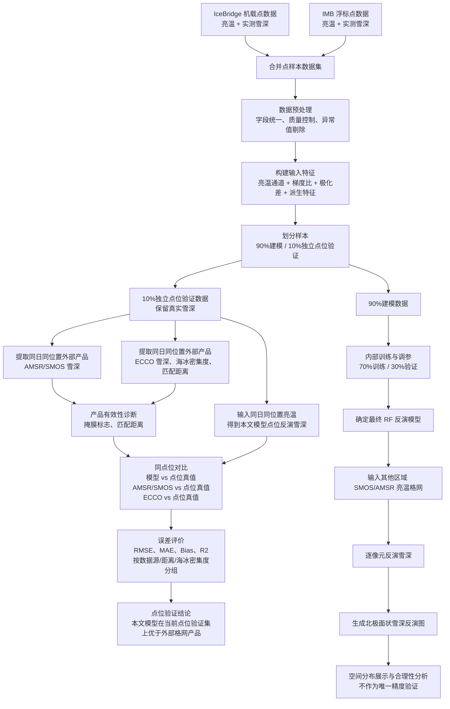

# 改进版反演技术路线

## 核心调整

原流程可以保留，但表述需要更严谨：本文模型的主要验证对象是 IceBridge/IMB 点位真实雪深；AMSR/SMOS 与 ECCO 只作为外部格网产品对比，不作为绝对真值。这样可以解释外部产品误差偏大的原因：点-面尺度差异、最近邻距离、产品掩膜、产品变量定义不同。

## 推荐流程图

## 汇报时建议的说法

1. 本文模型使用 IceBridge 与 IMB 点位观测作为监督样本，目标是建立亮温到雪深的经验反演关系。
2. 10% 独立点位样本完全不参与训练和调参，用于点位尺度精度评价。
3. 外部产品包括 AMSR/SMOS 雪深产品和 ECCO L4 再分析产品。二者与点位真值的比较属于点-面尺度对比，因此误差可能偏大。
4. 为避免不公平比较，增加产品有效性诊断：产品掩膜、最近邻距离、ECCO 海冰密集度、数据源分组。
5. 区域反演图用于展示模型应用到面状亮温格网后的空间分布效果，精度结论仍以点位独立验证为主。

## 需要补充的实验

1. 常规随机 90%/10% 验证：作为主结果，说明整体点位拟合能力。
2. 同产品有效点比较：模型与外部产品只在共同有效点上比较，避免样本数量不同导致偏差。
3. 产品质量分组比较：例如 ECCO 海冰密集度大于 0.8、匹配距离小于 20 km 的子集。
4. 数据源分组比较：分别报告 IceBridge 与 IMB 上的误差。
5. 更严格泛化验证：后续建议增加按年份或按浮标编号留一验证，检查模型是否依赖相邻时空样本。

